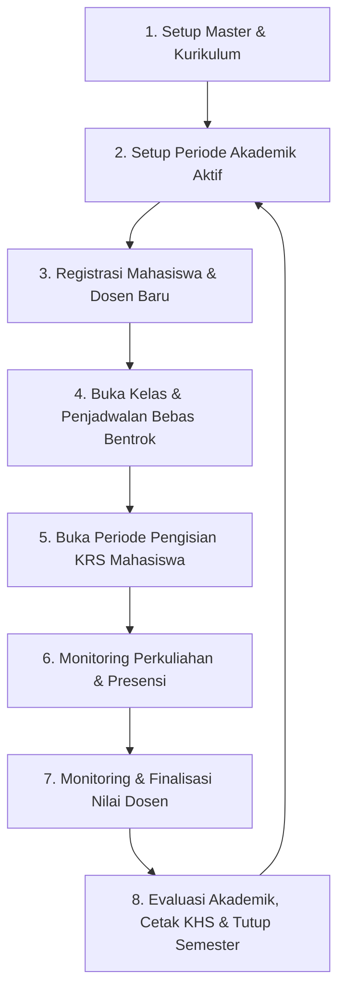

# Master Plan — Fitur Role Admin (Sistem Informasi Akademik)

> Dokumen acuan utama perancangan dan implementasi fitur untuk **Role Admin** pada Sistem Informasi Akademik (SIA) multiplatform. Mengacu pada blueprint teknis [Rencana.md](file:///home/sejel/Documents/SIAKAD_Kampus/Rencana.md), struktur arsitektur [ARCHITECTURE.md](file:///home/sejel/Documents/SIAKAD_Kampus/ARCHITECTURE.md), dan skema basis data PostgreSQL [ERD.md](file:///home/sejel/Documents/SIAKAD_Kampus/ERD.md).

---

## 1. Gambaran Umum & Tanggung Jawab Role Admin

Dalam ekosistem SIAKAD, **Admin** bertindak sebagai *Superuser* operasional akademik institusi. Admin bertanggung jawab terhadap:
1. Menjaga kelengkapan data master kelembagaan (Prodi, Kurikulum, Mata Kuliah, Ruangan).
2. Mengelola identitas pengguna, akun, dan penetapan peran (Admin, Dosen, Mahasiswa).
3. Mengatur siklus semester aktif dan membuka penawaran kelas perkuliahan.
4. Melakukan plotting dosen pengampu dan menyusun jadwal bebas bentrok (*conflict-free scheduling*).
5. Mengawasi keterisian KRS, rekapitulasi presensi perkuliahan, dan pengesahan nilai akhir.
6. Memantau keamanan dan rekam jejak aktivitas sistem melalui *audit logs*.

---

## 2. Siklus Operasional Akademik (Lifecycle Workflow)

Alur kerja berkala yang dikendalikan oleh Admin dalam satu siklus semester akademik:



---

## 3. Matriks Fitur & Prioritas Implementasi

Pengelompokan fitur berdasarkan tahapan rilis pengembangan aplikasi:

| No | Modul Fitur | Deskripsi Singkat | Prioritas | Tautan Spesifikasi Detail |
|:--:|:---|:---|:---:|:---|
| **01** | **Dashboard & Statistik** | Cockpit eksekutif: KPI cards, timeline semester, antrean approval, early warning kuota & nilai, live log | **P0 (MVP)** | [01_dashboard_dan_statistik.md](file:///home/sejel/Documents/SIAKAD_Kampus/fitur_admin/01_dashboard_dan_statistik.md) |
| **02** | **Manajemen Pengguna & Role** | CRUD User Supabase Auth, penugasan `role`, reset password, aktivasi | **P0 (MVP)** | [02_manajemen_pengguna_dan_role.md](file:///home/sejel/Documents/SIAKAD_Kampus/fitur_admin/02_manajemen_pengguna_dan_role.md) |
| **03** | **Master Data Akademik** | Kelola `program_studi`, switch `periode_akademik` aktif, master `ruangan` | **P0 (MVP)** | [03_master_data_akademik.md](file:///home/sejel/Documents/SIAKAD_Kampus/fitur_admin/03_master_data_akademik.md) |
| **04** | **Kurikulum & Mata Kuliah** | Master `mata_kuliah`, versi `kurikulum`, paket semester 1–8 | **P0 (MVP)** | [04_kurikulum_dan_mata_kuliah.md](file:///home/sejel/Documents/SIAKAD_Kampus/fitur_admin/04_kurikulum_dan_mata_kuliah.md) |
| **05** | **Manajemen Civitas Akademika** | Data Mahasiswa (Generator/Validator NPM 10 digit), Data Dosen (NIDN) | **P0 (MVP)** | [05_manajemen_civitas_akademika.md](file:///home/sejel/Documents/SIAKAD_Kampus/fitur_admin/05_manajemen_civitas_akademika.md) |
| **06** | **Kelas & Penjadwalan** | Buka `kelas`, plotting `kelas_dosen`, `jadwal_kelas`, deteksi bentrok ruang & dosen | **P0 (MVP)** | [06_kelas_dan_penjadwalan.md](file:///home/sejel/Documents/SIAKAD_Kampus/fitur_admin/06_kelas_dan_penjadwalan.md) |
| **07** | **Administrasi & Monitoring KRS** | Jadwal KRS, monitoring progres KRS, intervensi force-add/drop | **P0 (MVP)** | [07_administrasi_krs.md](file:///home/sejel/Documents/SIAKAD_Kampus/fitur_admin/07_administrasi_krs.md) |
| **08** | **Monitoring Nilai & Evaluasi** | Monitoring status finalisasi nilai dosen, rekap KHS, transkrip, unlock nilai | **P1** | [08_monitoring_nilai_dan_evaluasi.md](file:///home/sejel/Documents/SIAKAD_Kampus/fitur_admin/08_monitoring_nilai_dan_evaluasi.md) |
| **09** | **Monitoring Presensi** | Ketercapaian 16 pertemuan, deteksi ambang batas kehadiran < 75% | **P1** | [09_monitoring_presensi.md](file:///home/sejel/Documents/SIAKAD_Kampus/fitur_admin/09_monitoring_presensi.md) |
| **10** | **Audit Log & Keamanan** | Penjelajah riwayat aksi, metadata inspect, ekspor log akreditasi | **P1** | [10_audit_log_dan_keamanan.md](file:///home/sejel/Documents/SIAKAD_Kampus/fitur_admin/10_audit_log_dan_keamanan.md) |
| **11** | **Dosen Wali & Bimbingan** | Plotting Dosen PA, monitoring approval KRS dosen wali, bypass darurat | **P1** | [11_dosen_wali_dan_bimbingan.md](file:///home/sejel/Documents/SIAKAD_Kampus/fitur_admin/11_dosen_wali_dan_bimbingan.md) |
| **12** | **Kelulusan & Yudisium** | Degree audit otomatis (144 SKS, tanpa E), SK yudisium, predikat, PIN ijazah | **P1** | [12_kelulusan_dan_yudisium.md](file:///home/sejel/Documents/SIAKAD_Kampus/fitur_admin/12_kelulusan_dan_yudisium.md) |
| **13** | **Pelaporan PDDIKTI** | Pre-flight validation NIK/NIDN/AKM, ekspor CSV/Excel standar Neo Feeder | **P2** | [13_pelaporan_pddikti_dan_ekspor.md](file:///home/sejel/Documents/SIAKAD_Kampus/fitur_admin/13_pelaporan_pddikti_dan_ekspor.md) |
| **14** | **Konversi Nilai & Transfer** | Equivalence mapping mahasiswa pindahan, alih jenjang, konversi MBKM 20 SKS | **P2** | [14_konversi_nilai_dan_transfer.md](file:///home/sejel/Documents/SIAKAD_Kampus/fitur_admin/14_konversi_nilai_dan_transfer.md) |
| **15** | **Surat & Dokumen Akademik** | Generator surat aktif/magang/riset otomatis, penomoran otomatis, verifikasi QR | **P2** | [15_surat_dan_dokumen_akademik.md](file:///home/sejel/Documents/SIAKAD_Kampus/fitur_admin/15_surat_dan_dokumen_akademik.md) |

> **Keterangan Prioritas:**
> - **P0 (MVP)**: Fondasi wajib agar perkuliahan dasar dan siklus KRS mahasiswa dapat berjalan.
> - **P1**: Fitur pengawasan, evaluasi akademik, dan pelaporan lanjutan.

---

## 4. Struktur Navigasi & Routing UI (Flutter Web, Windows, Android)

Mengacu pada konfigurasi GoRouter di [ARCHITECTURE.md](file:///home/sejel/Documents/SIAKAD_Kampus/ARCHITECTURE.md#L305-L330):

```
/admin
  ├── /admin/dashboard                → Dashboard KPI, Alert Center & Shortcut
  ├── /admin/users                    → Manajemen Akun Pengguna & Assign Role
  ├── /admin/master
  │     ├── /admin/master/prodi       → Kelola Program Studi
  │     ├── /admin/master/periode     → Kelola & Aktivasi Periode Akademik
  │     └── /admin/master/ruangan     → Kelola Ruangan Kelas & Gedung
  ├── /admin/akademik
  │     ├── /admin/akademik/mk        → Bank Mata Kuliah
  │     └── /admin/akademik/kurikulum → Manajemen Kurikulum & Matriks Semester
  ├── /admin/civitas
  │     ├── /admin/civitas/mahasiswa  → Data Mahasiswa, NPM Generator & Status
  │     └── /admin/civitas/dosen      → Data Dosen, NIDN & Beban Mengajar
  ├── /admin/perkuliahan
  │     ├── /admin/perkuliahan/kelas  → Buka Kelas & Plotting Dosen Pengampu
  │     └── /admin/perkuliahan/jadwal → Alokasi Ruang & Mesin Deteksi Bentrok
  ├── /admin/krs                      → Monitoring Pengisian & Override KRS
  ├── /admin/dosen-wali               → Plotting & Monitoring Dosen Wali (PA)
  ├── /admin/nilai                    → Monitoring Input Nilai, Rekap KHS & Unlock
  ├── /admin/presensi                 → Monitoring Pertemuan & Screening < 75%
  ├── /admin/yudisium                 → Degree Audit Kelulusan, SK Yudisium & Wisuda
  ├── /admin/konversi                 → Equivalence Mapping Nilai Transfer & MBKM
  ├── /admin/pddikti                  → Pre-flight Health Check & Ekspor Neo Feeder
  ├── /admin/persuratan               → Permohonan & Penerbitan Surat Akademik QR
  └── /admin/logs                     → Audit Trail Explorer & Inspeksi Metadata
```

---

## 5. Ringkasan Modul Spesifikasi Teknis

Setiap fitur memiliki dokumentasi spesifikasi rinci pada direktori [fitur_admin/](file:///home/sejel/Documents/SIAKAD_Kampus/fitur_admin):

1. **[01_dashboard_dan_statistik.md](file:///home/sejel/Documents/SIAKAD_Kampus/fitur_admin/01_dashboard_dan_statistik.md)**
   Cockpit eksekutif: KPI cards, timeline fase semester, antrean persetujuan/task queue, early warning kuota & keterisian nilai, tingkat okupansi ruang, distribusi SKS, streaming audit log live, dan broadcast pengumuman.
2. **[02_manajemen_pengguna_dan_role.md](file:///home/sejel/Documents/SIAKAD_Kampus/fitur_admin/02_manajemen_pengguna_dan_role.md)**
   Pengelolaan akun di Supabase Auth, penugasan peran multi-role (`user_role`), reset password pengguna, dan penonaktifan akun aman.
3. **[03_master_data_akademik.md](file:///home/sejel/Documents/SIAKAD_Kampus/fitur_admin/03_master_data_akademik.md)**
   Master Program Studi, mekanisme aktivasi tunggal semester aktif (`periode_akademik.aktif = true`), serta master ruangan dan kapasitas kursi.
4. **[04_kurikulum_dan_mata_kuliah.md](file:///home/sejel/Documents/SIAKAD_Kampus/fitur_admin/04_kurikulum_dan_mata_kuliah.md)**
   Katalog mata kuliah (Wajib/Pilihan), manajemen versi kurikulum per prodi, dan mapping semester rekomendasi (1 s.d. 8).
5. **[05_manajemen_civitas_akademika.md](file:///home/sejel/Documents/SIAKAD_Kampus/fitur_admin/05_manajemen_civitas_akademika.md)**
   Pengelolaan mahasiswa dengan pemenuhan pola NPM 10 digit (`Angkatan(2) + Fak(3) + Prodi(2) + Urut(3)`), status mahasiswa, serta NIDN dosen dan homebase.
6. **[06_kelas_dan_penjadwalan.md](file:///home/sejel/Documents/SIAKAD_Kampus/fitur_admin/06_kelas_dan_penjadwalan.md)**
   Buka kelas perkuliahan, penugasan dosen utama & co-dosen, alokasi ruang, dan mesin deteksi bentrok (*Room & Lecturer Conflict Detection*).
7. **[07_administrasi_krs.md](file:///home/sejel/Documents/SIAKAD_Kampus/fitur_admin/07_administrasi_krs.md)**
   Pengaturan jendela registrasi KRS, monitoring real-time pengisian, validasi beban SKS maksimal, dan hak intervensi force-add/pindah kelas oleh Admin.
8. **[08_monitoring_nilai_dan_evaluasi.md](file:///home/sejel/Documents/SIAKAD_Kampus/fitur_admin/08_monitoring_nilai_dan_evaluasi.md)**
   Pantauan kepatuhan dosen menginput nilai, rekap KHS, perhitungan IPS/IPK, cetak transkrip, serta mekanisme buka kunci nilai (*unlock grade*).
9. **[09_monitoring_presensi.md](file:///home/sejel/Documents/SIAKAD_Kampus/fitur_admin/09_monitoring_presensi.md)**
   Ketercapaian standar 16 pertemuan kelas, rekapitulasi kehadiran mahasiswa, dan penyaringan otomatis mahasiswa dengan kehadiran di bawah 75%.
10. **[10_audit_log_dan_keamanan.md](file:///home/sejel/Documents/SIAKAD_Kampus/fitur_admin/10_audit_log_dan_keamanan.md)**
    Penelusuran jejak audit transaksi penting, inspeksi JSON metadata sebelum/sesudah perubahan, dan ekspor riwayat aktivitas sistem.
11. **[11_dosen_wali_dan_bimbingan.md](file:///home/sejel/Documents/SIAKAD_Kampus/fitur_admin/11_dosen_wali_dan_bimbingan.md)**
    Alokasi & mutasi Dosen Wali (PA), kuota bimbingan mahasiswa, monitoring progres persetujuan KRS, dan otorisasi *bypass* darurat.
12. **[12_kelulusan_dan_yudisium.md](file:///home/sejel/Documents/SIAKAD_Kampus/fitur_admin/12_kelulusan_dan_yudisium.md)**
    Audit kelayakan kelulusan otomatis (*degree audit*), penerbitan SK Yudisium, kalkulasi predikat kelulusan (*Cum Laude*), Penomoran Ijazah Nasional (PIN), dan SKPI.
13. **[13_pelaporan_pddikti_dan_ekspor.md](file:///home/sejel/Documents/SIAKAD_Kampus/fitur_admin/13_pelaporan_pddikti_dan_ekspor.md)**
    Pra-pemeriksaan anomali data (*pre-flight validation* NIK/NIDN/AKM), dan ekspor data paket berkala standar PDDikti Neo Feeder.
14. **[14_konversi_nilai_dan_transfer.md](file:///home/sejel/Documents/SIAKAD_Kampus/fitur_admin/14_konversi_nilai_dan_transfer.md)**
    Pengakuan kredit (*credit transfer*) mahasiswa pindahan/alih jenjang, konversi nilai program MBKM (magang/studi independen 20 SKS), dan SK penyetaraan nilai.
15. **[15_surat_dan_dokumen_akademik.md](file:///home/sejel/Documents/SIAKAD_Kampus/fitur_admin/15_surat_dan_dokumen_akademik.md)**
    Layanan persuratan mandiri (Surat Keterangan Aktif, Pengantar Magang, Izin Riset), penomoran surat otomatis, dan verifikasi keabsahan dokumen publik via kode QR.
