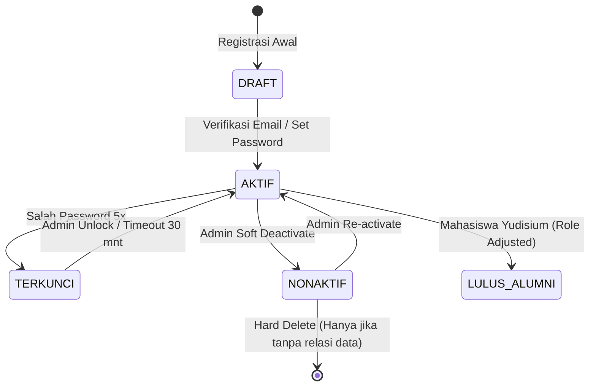

# 02 — Manajemen Pengguna & Peran (User & Role Management)

> Modul pengelolaan akun sistem terpusat, pengaitan identitas ke Supabase Auth, penugasan role multi-tier (`ADMIN`, `DOSEN`, `MAHASISWA`), kontrol status akses pengguna, dan audit keamanan akun.

---

## 1. Tujuan & Ruang Lingkup Fitur

Memastikan tata kelola siklus hidup akun pengguna (*user lifecycle*) dari seluruh civitas akademika berjalan aman, terintegrasi penuh antara `auth.users` (Supabase Authentication Engine) dengan tabel profil aplikasi (`public.user`, `public.role`, `public.user_role`), serta mematuhi prinsip *Least Privilege Access Control*.

### Ruang Lingkup Modul:
1. **Identitas & Kredensial**: Penyediaan akun baru, pengikatan email institusi, pembuatan sandi awal aman (*secure temporary password*), dan mekanisme verifikasi email.
2. **Hierarki & Matriks Peran**: Penugasan peran tunggal maupun multi-peran (misal: Dosen yang merangkap tugas struktural sebagai Admin Prodi).
3. **Manajemen Status Akses**: Deaktivasi aman (*soft-freeze*) untuk memblokir login tanpa memutus relasi data historis akademik.
4. **Pemulihan Akses (Account Recovery)**: Pemicuan reset password, pembukaan akun terblokir (*unlock lockout*), dan regenerasi tautan aktivasi.
5. **Pencegahan Anomali Sistem**: Larangan penghapusan akun yang memiliki keterikatan integritas referensial (KRS, jadwal, nilai, log aktivitas).

---

## 2. Desain Antarmuka Pengguna & Wireframe ASCII

### 2.1 Tata Letak Halaman Utama (Desktop / Web ≥ 1024 px)
```
┌────────────────────────────────────────────────────────────────────────────────────────────────────────┐
│ 👥 MANAJEMEN PENGGUNA & PERAN                                    [+ Tambah Pengguna] [⬇ Ekspor CSV]    │
├────────────────────────────────────────────────────────────────────────────────────────────────────────┤
│ 🔍 [Cari Nama / Email / Identitas...] │ Peran: [Semua Peran ▼] │ Status: [Aktif ▼] │ [⟳ Segarkan]     │
├────────────────────────────────────────────────────────────────────────────────────────────────────────┤
│ TABEL DATA PENGGUNA (Menampilkan 1 - 25 dari 1.542 Akun)                                               │
├──────┬──────────────────────┬───────────────────────────┬──────────────┬──────────┬──────────┬─────────┤
│ NO   │ NAMA LENGKAP         │ EMAIL / USERNAME          │ PERAN        │ STATUS   │ LOGIN TERAKHIR │ AKSI  │
├──────┼──────────────────────┼───────────────────────────┼──────────────┼──────────┼──────────┼─────────┤
│ 01   │ Dr. Aris Munandar    │ aris.munandar@kampus.ac.id│ [DOSEN][ADMIN│ ● AKTIF  │ 10 mnt lalu│ [⚙ ▼]   │
│ 02   │ Siti Nurhaliza       │ siti.261001@mhs.kampus... │ [MAHASISWA]  │ ● AKTIF  │ 2 jam lalu │ [⚙ ▼]   │
│ 03   │ Budi Santoso, M.T.   │ budi.santoso@kampus.ac.id │ [DOSEN]      │ ○ NONAKTIF│ 14 hari lalu│ [⚙ ▼]  │
│ 04   │ Rendy Firmansyah     │ rendy.251002@mhs.kampus...│ [MAHASISWA]  │ 🔒 TERKUNCI│ Kemarin  │ [⚙ ▼]   │
├──────┴──────────────────────┴───────────────────────────┴──────────────┴──────────┴──────────┴─────────┤
│ Halaman: [ < Sebelumnya ] 1  2  3  4  5 ... 62 [ Selanjutnya > ]              Baris per halaman: [25 ▼]│
└────────────────────────────────────────────────────────────────────────────────────────────────────────┘
  Menu Aksi [⚙ ▼]: [Detail Profil] | [Ubah Peran] | [Reset Password] | [Kunci/Buka Akses] | [Audit Trail]
```

### 2.2 Wireframe Modal Tambah / Edit Pengguna
```
┌────────────────────────────────────────────────────────────────┐
│ ➕ FORMULIR REGISTRASI PENGGUNA SISTEM                 [ X ]   │
├────────────────────────────────────────────────────────────────┤
│ 1. IDENTITAS AKUN                                              │
│    Nama Lengkap *       : [ Dr. Hendra Wijaya, S.T., M.Eng.  ] │
│    Email Institusi *    : [ hendra.wijaya@kampus.ac.id       ] │
│    Nomor Telepon / WA   : [ +62 812-3456-7890                ] │
│    URL Avatar (Opsional): [ https://storage.kampus.../avatar ] │
│                                                                │
│ 2. PENUGASAN PERAN (MULTI-SELECT) *                            │
│    [ ] ADMINISTRATOR  (Akses penuh kontrol institusi)          │
│    [X] DOSEN          (Portal pengajaran, nilai & presensi)    │
│    [ ] MAHASISWA      (Portal registrasi KRS & KHS)            │
│                                                                │
│ 3. PENGATURAN KREDENSIAL AWAL                                  │
│    Metode Otentikasi:                                          │
│    (o) Kirim Magic Link / Tautan Aktivasi ke Email Pengguna    │
│    ( ) Buat Kata Sandi Sementara Manual: [ ********** ] [👁]   │
│        [X] Wajibkan ganti password pada saat login pertama kali│
│                                                                │
│ 4. STATUS AWAL AKUN                                            │
│    Status: (o) Aktif Langsung    ( ) Tangguhkan Sementara      │
├────────────────────────────────────────────────────────────────┤
│ [ Batal ]                                   [ Simpan Pengguna ]│
└────────────────────────────────────────────────────────────────┘
```

---

## 3. Rincian Fitur & Alur Operasional

### 3.1 Pencarian, Penyaringan, dan Paginasi Cerdas
- **Pencarian Multi-Kriteria**: Pencarian secara *debounce* (300ms) mencakup:
  - `user.nama_lengkap` (case-insensitive `ILIKE`).
  - `user.email` (pencocokan parsial).
  - Nomor Induk identitas tertaut (NPM pada `mahasiswa` atau NIDN pada `dosen`).
- **Filter Berlapis**:
  - Filter Peran: `SEMUA`, `ADMIN`, `DOSEN`, `MAHASISWA`, `MULTI-ROLE`.
  - Filter Status: `SEMUA`, `AKTIF` (`aktif = true`), `NONAKTIF` (`aktif = false`), `TERKUNCI` (terkunci akibat salah input password berulang).
  - Filter Rentang Tanggal Terdaftar & Tanggal Login Terakhir.
- **Paginasi Sisi Server (Server-Side Pagination)**:
  - Menggunakan kueri berbasis limit dan offset teroptimasi (`LIMIT 25 OFFSET (page-1)*25`).

### 3.2 Alur Pembuatan Akun Baru (User Provisioning)
Proses pembuatan akun terikat secara atomik (*two-phase transaction*) antara Supabase Auth dan tabel relasional publik:
1. Admin mengisi data identitas, email, dan memilih satu atau lebih peran.
2. Sistem mengecek ketersediaan email pada `auth.users` dan `public.user`. Jika telah terdaftar, formulir menampilkan pesan kesalahan *“Email telah digunakan oleh akun lain”*.
3. Sistem memanggil PostgreSQL Stored Function `admin_create_user()` dengan hak `SECURITY DEFINER` (atau melalui Supabase Admin API / Edge Function) untuk:
   - Membuat record baru pada `auth.users` dengan metadata peran.
   - Menginjeksi row pada tabel `public.user`.
   - Menginjeksi entitas relasi peran pada tabel `public.user_role`.
   - Menghasilkan event log pada `public.log_aktivitas`.
4. Jika opsi kirim email dipilih, Supabase Auth mengirimkan template email aktivasi resmi kampus ke alamat surel yang didaftarkan.

### 3.3 Penugasan Multi-Peran & Otorisasi Hirarkis
- Satu pengguna dapat memegang beberapa peran secara legal (`1:N` antara `user` dan `user_role`).
- Kasus umum multi-role:
  - **Dosen + Admin**: Dosen yang diberi amanah sebagai Admin Program Studi atau Bagian Penjaminan Mutu.
  - **Mahasiswa + Asisten Lab**: Akun utama Mahasiswa dengan privilege terbatas untuk pengelolaan presensi praktikum.
- Antarmuka pemilihan peran berupa tag multi-select dinamis.
- Pencabutan peran admin pada akun lain hanya dapat dilakukan oleh sesama Administrator.

### 3.4 Manajemen Kata Sandi & Keamanan
1. **Reset Password oleh Admin**:
   - Opsi A (*Self-Service*): Admin memicu tombol *"Kirim Tautan Reset Sandi"*. Supabase Auth mengirimkan token reset ke email terdaftar dengan masa berlaku 24 jam.
   - Opsi B (*Administrative Bypass*): Admin menetapkan password sementara secara manual (misal saat mahasiswa/dosen terkendala akses email). Sistem otomatis memberi flag `user.metadata->>'force_password_change' = 'true'`.
2. **Kepatuhan Kebijakan Kata Sandi (Password Policy)**:
   - Panjang minimal 8 karakter.
   - Kombinasi minimal 1 huruf besar, 1 huruf kecil, dan 1 karakter angka/simbol.
3. **Mekanisme Pembukaan Kunci Akun (Account Unlock)**:
   - Jika pengguna salah memasukkan password lebih dari 5 kali berturut-turut, akun terkunci sementara selama 30 menit. Admin dapat melakukan pembukaan instan (*instant unlock*) dari dashboard.

### 3.5 Kebijakan Deaktivasi vs Penghapusan Fisik
- **Soft Deactivation (`aktif = false`)**:
  - Menghentikan sesi aktif (revokasi token JWT via Supabase Admin API).
  - Pengguna tidak dapat login kembali (`auth.signInWithPassword` akan ditolak dengan pesan: *"Akun Anda telah dinonaktifkan oleh Administrator. Hubungi Biro Akademik."*).
  - Seluruh data historis pengajaran dosen, KRS mahasiswa, dan nilai tetap utuh.
- **Pencegahan Hard-Delete (Restricted Deletion)**:
  - Sistem menolak penghapusan baris pada `public.user` apabila `id` telah berelasi dengan tabel `mahasiswa`, `dosen`, `log_aktivitas`, atau transaksi akademik lainnya.

---

## 4. Logika Bisnis, Algoritma, & State Machine

### 4.1 State Machine Siklus Hidup Akun Pengguna


### 4.2 Algoritma Proteksi Pencegahan Lockout Mandiri (Self-Lockout Prevention)
```dart
// Logika validasi sebelum eksekusi deaktivasi atau pencabutan role admin
Future<ValidationResult> validateUserAction({
  required String targetUserId,
  required String currentAdminId,
  required String actionType, // 'DEACTIVATE' atau 'REVOKE_ADMIN'
}) async {
  // 1. Larangan memanipulasi akun sendiri
  if (targetUserId == currentAdminId) {
    return ValidationResult.failed(
      'Tindakan Ditolak: Anda tidak dapat menonaktifkan atau mencabut hak Administrator akun Anda sendiri.',
    );
  }

  // 2. Proteksi Admin Tunggal: Pastikan institusi memiliki minimal 1 Admin aktif lain
  if (actionType == 'DEACTIVATE' || actionType == 'REVOKE_ADMIN') {
    final activeAdminCount = await repository.countActiveAdminsExcept(targetUserId);
    if (activeAdminCount < 1) {
      return ValidationResult.failed(
        'Tindakan Ditolak: Pengguna ini adalah Administrator aktif terakhir dalam sistem. Tunjuk Admin lain sebelum melakukan tindakan ini.',
      );
    }
  }

  return ValidationResult.success();
}
```

### 4.3 Logika Generator Kata Sandi Sementara Aman
Kata sandi sementara dihasilkan secara acak dengan entropi tinggi dan diformat agar mudah dibaca pengguna:
- Format: `[KataSifat]-[KataBenda]-[3DigitAngka]!`
- Contoh: `Kampus-Unggul-782!`
- Memenuhi persyaratan kompleksitas huruf besar, huruf kecil, angka, dan simbol.

---

## 5. Skema Data & Kueri Database Terkait

### 5.1 Struktur Tabel `public.user`, `public.role`, dan `public.user_role`
```sql
-- Tabel Pengguna Utama (Tersinkronisasi dengan auth.users)
CREATE TABLE IF NOT EXISTS public."user" (
    id UUID PRIMARY KEY REFERENCES auth.users(id) ON DELETE RESTRICT,
    email TEXT NOT NULL UNIQUE,
    nama_lengkap TEXT NOT NULL,
    telepon TEXT,
    url_avatar TEXT,
    aktif BOOLEAN NOT NULL DEFAULT true,
    dibuat_pada TIMESTAMP WITH TIME ZONE DEFAULT NOW(),
    diperbarui_pada TIMESTAMP WITH TIME ZONE DEFAULT NOW()
);

-- Tabel Master Peran Sistem
CREATE TABLE IF NOT EXISTS public.role (
    id UUID PRIMARY KEY DEFAULT gen_random_uuid(),
    nama TEXT NOT NULL UNIQUE -- 'ADMIN', 'DOSEN', 'MAHASISWA'
);

-- Tabel Asosiasi Penugasan Peran (Many-to-Many)
CREATE TABLE IF NOT EXISTS public.user_role (
    id UUID PRIMARY KEY DEFAULT gen_random_uuid(),
    id_user UUID NOT NULL REFERENCES public."user"(id) ON DELETE CASCADE,
    id_role UUID NOT NULL REFERENCES public.role(id) ON DELETE RESTRICT,
    ditugaskan_pada TIMESTAMP WITH TIME ZONE DEFAULT NOW(),
    CONSTRAINT uq_user_role UNIQUE (id_user, id_role)
);
```

### 5.2 Stored Procedure: Registrasi Pengguna Atomik
```sql
CREATE OR REPLACE FUNCTION public.fn_admin_create_user(
    p_email TEXT,
    p_nama_lengkap TEXT,
    p_telepon TEXT,
    p_roles TEXT[], -- Contoh: ARRAY['DOSEN', 'ADMIN']
    p_actor_id UUID
)
RETURNS UUID
LANGUAGE plpgsql
SECURITY DEFINER
AS $$
DECLARE
    v_user_id UUID;
    v_role_name TEXT;
    v_role_id UUID;
BEGIN
    -- Validasi apakah pemanggil adalah Admin
    IF NOT EXISTS (
        SELECT 1 FROM public.user_role ur
        JOIN public.role r ON ur.id_role = r.id
        WHERE ur.id_user = p_actor_id AND r.nama = 'ADMIN'
    ) THEN
        RAISE EXCEPTION 'Akses Ditolak: Hanya Administrator yang berwenang membuat pengguna baru.';
    END IF;

    -- Generate UUID baru untuk User
    v_user_id := gen_random_uuid();

    -- Injeksi ke public.user
    INSERT INTO public."user" (id, email, nama_lengkap, telepon, aktif)
    VALUES (v_user_id, LOWER(TRIM(p_email)), TRIM(p_nama_lengkap), TRIM(p_telepon), true);

    -- Loop penugasan peran
    FOREACH v_role_name IN ARRAY p_roles
    LOOP
        SELECT id INTO v_role_id FROM public.role WHERE nama = UPPER(v_role_name);
        IF v_role_id IS NOT NULL THEN
            INSERT INTO public.user_role (id_user, id_role)
            VALUES (v_user_id, v_role_id)
            ON CONFLICT DO NOTHING;
        END IF;
    END LOOP;

    -- Catat ke log aktivitas
    INSERT INTO public.log_aktivitas (id_user, aksi, entitas, id_entitas, metadata)
    VALUES (
        p_actor_id,
        'ADMIN_BUAT_PENGGUNA',
        'user',
        v_user_id,
        jsonb_build_object(
            'email', p_email,
            'nama_lengkap', p_nama_lengkap,
            'roles', p_roles
        )
    );

    RETURN v_user_id;
END;
$$;
```

### 5.3 Kebijakan Row Level Security (RLS)
```sql
ALTER TABLE public."user" ENABLE ROW LEVEL SECURITY;
ALTER TABLE public.user_role ENABLE ROW LEVEL SECURITY;

-- Kebijakan: Admin dapat melihat dan mengelola seluruh user
CREATE POLICY "admin_all_user_policy"
ON public."user"
FOR ALL
USING (
    EXISTS (
        SELECT 1 FROM public.user_role ur
        JOIN public.role r ON ur.id_role = r.id
        WHERE ur.id_user = auth.uid() AND r.nama = 'ADMIN'
    )
);

-- Kebijakan: Pengguna non-admin hanya dapat melihat profil mereka sendiri
CREATE POLICY "user_view_own_profile"
ON public."user"
FOR SELECT
USING (id = auth.uid());
```

---

## 6. Struktur Log Aktivitas & Payload Metadata JSON

Setiap intervensi tata kelola akun menghasilkan rekaman audit terperinci pada tabel `log_aktivitas`:

```json
{
  "event_timestamp": "2026-09-28T10:45:00+08:00",
  "actor_id": "c1f8a840-7e32-4759-9943-8f0a0d4c9801",
  "actor_name": "Administrator Pusat",
  "aksi": "ADMIN_UBAH_PERAN_PENGGUNA",
  "entitas": "user_role",
  "id_entitas": "f47ac10b-58cc-4372-a567-0e02b2c3d479",
  "metadata": {
    "target_user_email": "aris.munandar@kampus.ac.id",
    "target_user_name": "Dr. Aris Munandar",
    "previous_roles": ["DOSEN"],
    "new_roles": ["DOSEN", "ADMIN"],
    "reason": "Penetapan Pelaksana Tugas (Plt) Kepala Biro Akademik",
    "ip_address": "192.168.1.45",
    "user_agent": "Flutter-Desktop/Windows (x86_64)"
  }
}
```

---

## 7. Penanganan Kasus Khusus (Edge Cases) & Validasi Ketat

| Kasus Khusus / Skenario Ekstrem | Potensi Masalah | Solusi & Penanganan Sistem |
| :--- | :--- | :--- |
| **Email ganda (*duplicate email*)** | Tabrakan data autentikasi. | Validasi pre-flight case-insensitive `LOWER(email)` + DB Unique Constraint. UI menampilkan badge error langsung di bawah field email. |
| **Pencabutan admin terakhir** | Seluruh civitas terkunci tanpa ada akun pengelola. | Pengecekan pra-eksekusi: Hitung total akun admin aktif. Jika target adalah satu-satunya admin aktif, aksi diblokir keras (*hard validation error*). |
| **Deaktivasi akun yang sedang login** | User nonaktif tetap bisa request data via token lama. | Panggil Supabase Admin API `auth.admin.signOut(userId)` secara real-time untuk membatalkan seluruh sesi dan refresh token. |
| **Akun memiliki transaksi historis** | Foreign Key violation saat mencoba hard-delete. | Tombol hapus fisik otomatis disembunyikan/dinonaktifkan jika `user.id` tercatat di `mahasiswa`, `dosen`, atau `log_aktivitas`. Hanya tombol `Deaktivasi` yang tersedia. |
| **Koneksi internet putus saat create user** | Record masuk di Supabase Auth tapi gagal di `public.user`. | Gunakan Stored Procedure atomik atau mekanisme kompensasi rollback otomatis (saga pattern). |

---

## 8. Panduan Integrasi Flutter Presentation (Riverpod & UI State)

1. **State Management**:
   - `userListProvider.family`: Provider berbasis filter `UserFilterState(search, role, status, page)`.
   - `userFormController`: Mengelola state form, validasi regex email/telepon, dan status loading transaksi.
2. **Komponen Reusable**:
   - `RoleBadgeWidget`: Menampilkan badge warna-warni berdasarkan peran (Admin: Ungu/Indigo, Dosen: Biru Laut, Mahasiswa: Hijau Zamrud).
   - `AccountStatusIndicator`: Dot indikator pulsasi hijau (Aktif), abu-abu (Nonaktif), dan merah gembok (Terkunci).
3. **Konfirmasi Tindakan Kritis**:
   - Dialog peringatan ganda (*destructive confirmation dialog*) saat melakukan reset password atau penonaktifan akun, mewajibkan admin mengetikkan kata *"KONFIRMASI"* untuk mencegah klik yang tidak disengaja.
