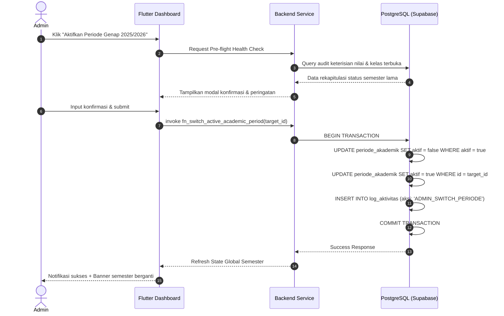

# 03 — Master Data Akademik (Program Studi, Periode, & Ruangan)

> Modul pengelolaan pondasi data kelembagaan kampus yang menjadi acuan utama bagi seluruh transaksi perkuliahan, penomoran induk mahasiswa, penjadwalan kelas, dan siklus semester.

---

## 1. Tujuan & Ruang Lingkup Fitur

Master data akademik merupakan pilar struktural Sistem Informasi Akademik (SIAKAD). Kesalahan atau inkonsistensi pada level ini akan berdampak sistemik pada seluruh modul hilir (KRS, penjadwalan, presensi, pelaporan PDDIKTI, hingga kelulusan).

### Ruang Lingkup Modul:
1. **Program Studi (`program_studi`)**: Manajemen data keilmuan, jenjang pendidikan, kode unik referensi NPM, penetapan ketua program studi (Kaprodi), dan status akreditasi.
2. **Periode Akademik (`periode_akademik`)**: Manajemen siklus tahun ajaran dan semester aktif dengan garansi atomik aturan *Single Active Semester Invariant*.
3. **Fasilitas Ruang Perkuliahan (`ruangan`)**: Inventarisasi ruang teori, laboratorium, dan auditorium kampus, validasi daya tampung kursi, serta pemantauan tingkat utilisasi ruang.

---

## 2. Desain Antarmuka Pengguna & Wireframe ASCII

### 2.1 Tampilan Antarmuka Berbasis Tab (Desktop / Web ≥ 1024 px)
```
┌────────────────────────────────────────────────────────────────────────────────────────────────────────┐
│ 🏛️ MASTER DATA AKADEMIK INSTITUSI                                                                     │
├────────────────────────────────────────────────────────────────────────────────────────────────────────┤
│ [ Tab: Program Studi (8) ]  |  [ Tab: Periode Akademik (12) ]  |  [ Tab: Ruangan & Gedung (46) ]       │
├────────────────────────────────────────────────────────────────────────────────────────────────────────┤
│ KONTROL TABEL: [ Periode Aktif Saat Ini: GANJIL 2025/2026 ● AKTIF ]         [+ Tambah Periode Baru]   │
│ 🔍 [Cari Semester / Tahun Ajaran...]           Filter: [Semua Semester ▼]    Urutkan: [Terbaru ▼]     │
├──────┬──────────────────────┬─────────────┬──────────┬──────────────┬──────────────┬──────────┬────────┤
│ NO   │ NAMA PERIODE         │ TAHUN AJARAN│ SEMESTER │ TGL MULAI    │ TGL SELESAI  │ STATUS   │ AKSI   │
├──────┼──────────────────────┼─────────────┼──────────┼──────────────┼──────────────┼──────────┼────────┤
│ 01   │ Ganjil 2025/2026     │ 2025/2026   │ GANJIL   │ 01 Sep 2025  │ 24 Jan 2026  │ ● AKTIF  │ [Edit] │
│ 02   │ Genap 2024/2025      │ 2024/2025   │ GENAP    │ 03 Feb 2025  │ 28 Jun 2025  │ ○ ARSIP  │ [Detail│
│ 03   │ Ganjil 2024/2025     │ 2024/2025   │ GANJIL   │ 02 Sep 2024  │ 25 Jan 2025  │ ○ ARSIP  │ [Detail│
│ 04   │ Antara 2023/2024     │ 2023/2024   │ PENDEK   │ 01 Jul 2024  │ 17 Ags 2024  │ ○ ARSIP  │ [Detail│
├──────┴──────────────────────┴─────────────┴──────────┴──────────────┴──────────────┴──────────┴────────┤
│ 💡 Catatan: Mengaktifkan periode baru akan secara otomatis mengarsipkan periode yang sedang berjalan. │
└────────────────────────────────────────────────────────────────────────────────────────────────────────┘
```

### 2.2 Wireframe Modal Wizard Aktivasi Semester Baru (Switch Semester)
```
┌────────────────────────────────────────────────────────────────┐
│ ⚠️ WIZARD PERGANTIAN PERIODE AKADEMIK AKTIF            [ X ]   │
├────────────────────────────────────────────────────────────────┤
│ Anda akan mengaktifkan: [ GENAP 2025/2026 ]                   │
│ Rentang Tanggal       : 02 Februari 2026 s.d. 27 Juni 2026     │
├────────────────────────────────────────────────────────────────┤
│ HASIL PRA-PEMERIKSAAN KELAYAKAN SISTEM (PRE-FLIGHT CHECK):     │
│ [✓] Seluruh kelas periode aktif sebelumnya telah selesai       │
│ [✓] 98.4% Nilai Dosen telah difinalisasi (Toleransi terpenuhi) │
│ [!] 12 Mahasiswa tercatat belum menyelesaikan administrasi KHS │
├────────────────────────────────────────────────────────────────┤
│ DAMPAK OTOMATIS SAAT DIAKTIFKAN:                               │
│ 1. Periode "Ganjil 2025/2026" berubah status menjadi NONAKTIF. │
│ 2. Pembukaan portal KRS Mahasiswa untuk semester baru.         │
│ 3. Seluruh jadwal kuliah baru merujuk ke periode ini.          │
│                                                                │
│ Ketik "AKTIFKAN SEMESTER BARU" untuk konfirmasi:               │
│ [ AKTIFKAN SEMESTER BARU                                     ] │
├────────────────────────────────────────────────────────────────┤
│ [ Batalkan ]                             [ Eksekusi Pergantian]│
└────────────────────────────────────────────────────────────────┘
```

---

## 3. Rincian Fitur & Aturan Bisnis

### 3.1 Pengelolaan Program Studi (`program_studi`)
- **Struktur Atribut Pokok**:
  - `id`: UUID Primary Key.
  - `kode`: Kode akronim prodi (contoh: `10` untuk TI, `20` untuk SI, `30` untuk Akuntansi). Harus berupa 2 digit unik numerik/alfanumerik karena digunakan sebagai Digit ke 6–7 dalam penomoran NPM mahasiswa.
  - `nama`: Nama resmi Program Studi (contoh: "Teknik Informatika", "Sistem Informasi"). Wajib & Unik.
  - `jenjang`: Pilihan enum (`D3`, `S1`, `S2`, `S3`). Menentukan total target SKS kelulusan (D3: 108–120 SKS, S1: 144–146 SKS).
  - `gelar_lulusan`: Nomenklatur gelar akademik (misal: "S.Kom.", "S.T.", "S.Ak.").
  - `sk_pendirian`: Nomor Keputusan Menteri izin operasional prodi untuk pelaporan PDDIKTI.
- **Validasi Integritas Relasional**:
  - Penghapusan program studi diblokir keras jika telah memiliki data mahasiswa, dosen pengampu, kurikulum, atau kelas tertaut.

### 3.2 Pengelolaan Periode Akademik (`periode_akademik`)
- **Struktur Atribut Pokok**:
  - `id`: UUID Primary Key.
  - `nama`: Label representatif (contoh: "Ganjil 2025/2026", "Genap 2025/2026", "Semester Antara 2025/2026").
  - `tahun_akademik`: Format regex `^\d{4}/\d{4}$` (contoh: `2025/2026`).
  - `semester`: Enum pilihan (`GANJIL`, `GENAP`, `PENDEK`).
  - `tanggal_mulai` & `tanggal_selesai`: Tanggal kalender akademik resmi (`tanggal_selesai > tanggal_mulai`).
  - `aktif`: Boolean penanda status.
- **Aturan Ketat Single Active Semester Invariant**:
  - Di seluruh isi tabel `periode_akademik`, hanya boleh ada **tepat satu baris** yang memiliki `aktif = true`.
  - Penegakan integritas menggunakan *PostgreSQL Unique Partial Index*:
    ```sql
    CREATE UNIQUE INDEX uq_single_active_academic_period 
    ON public.periode_akademik (aktif) 
    WHERE aktif = true;
    ```
- **Prosedur Pergantian Periode (Semester Transition Workflow)**:
  - Sebelum semester baru diaktifkan, sistem menjalankan *Pre-Flight Check*:
    1. Memeriksa persentase finalisasi nilai pada semester yang sedang berjalan (minimal 95%).
    2. Menghitung mahasiswa dengan status gantung (*unresolved enrollments*).
  - Saat tombol eksekusi disetujui, stored procedure atomik menonaktifkan periode lama dan menyalakan periode baru dalam satu transaksi terisolasi (`SERIALIZABLE` / `BEGIN ... COMMIT`).

### 3.3 Pengelolaan Ruang Perkuliahan (`ruangan`)
- **Struktur Atribut Pokok**:
  - `id`: UUID Primary Key.
  - `kode`: Kode unik ruangan (contoh: `GD-A-201`, `LAB-KOMP-1`, `AUDIT-01`).
  - `nama`: Nama deskriptif ruangan (contoh: "Ruang Teori Multimedia 1").
  - `kapasitas`: Daya tampung maksimum kursi peserta (`CHECK kapasitas > 0`). Digunakan untuk memvalidasi alokasi kelas agar pendaftar tidak melampaui kapasitas fisik ruangan.
  - `gedung`: Nama blok atau gedung kampus (contoh: "Gedung Teori A", "Gedung Laboratorium Terpadu").
  - `lantai`: Nomor lantai gedung (contoh: 1, 2, 3).
  - `tipe_ruangan`: Enum klasifikasi (`RUANG_TEORI`, `LABORATORIUM_KOMPUTER`, `LABORATORIUM_SAINS`, `AUDITORIUM`, `RUANG_SEMINAR`).
  - `fasilitas`: Array fasilitas penunjang (misal: `['AC', 'PROYEKTOR', 'SOUND_SYSTEM', 'SMART_TV', '35_PC']`).
- **Monitoring Utilisasi Ruang**:
  - Menghitung persentase jam terpakai terhadap total jam buka operasional kampus (07:00 s.d. 21:00 WIB) per minggu.

---

## 4. Logika Bisnis & Algoritma Penunjang

### 4.1 Logika Pergantian Semester Atomik


### 4.2 Algoritma Validasi Rentang Tanggal Periode
```dart
String? validateAcademicPeriodDates({
  required DateTime startDate,
  required DateTime endDate,
}) {
  final now = DateTime.now();
  if (endDate.isBefore(startDate)) {
    return 'Tanggal selesai semester tidak boleh mendahului tanggal mulai.';
  }
  
  final durationDays = endDate.difference(startDate).inDays;
  if (durationDays < 60) {
    return 'Durasi semester minimal adalah 60 hari kalender.';
  }
  if (durationDays > 210) {
    return 'Durasi semester maksimal adalah 210 hari (7 bulan).';
  }
  
  return null; // Valid
}
```

---

## 5. Skema Data & Kueri Database Terkait

### 5.1 Skema Tabel Master Data
```sql
-- 1. Tabel Program Studi
CREATE TABLE IF NOT EXISTS public.program_studi (
    id UUID PRIMARY KEY DEFAULT gen_random_uuid(),
    kode VARCHAR(10) NOT NULL UNIQUE,
    nama VARCHAR(150) NOT NULL UNIQUE,
    jenjang VARCHAR(10) NOT NULL CHECK (jenjang IN ('D3', 'S1', 'S2', 'S3')),
    gelar_lulusan VARCHAR(50),
    sk_pendirian VARCHAR(100),
    dibuat_pada TIMESTAMP WITH TIME ZONE DEFAULT NOW(),
    diperbarui_pada TIMESTAMP WITH TIME ZONE DEFAULT NOW()
);

-- 2. Tabel Periode Akademik
CREATE TABLE IF NOT EXISTS public.periode_akademik (
    id UUID PRIMARY KEY DEFAULT gen_random_uuid(),
    nama VARCHAR(100) NOT NULL UNIQUE,
    tahun_akademik VARCHAR(20) NOT NULL, -- Format: '2025/2026'
    semester VARCHAR(10) NOT NULL CHECK (semester IN ('GANJIL', 'GENAP', 'PENDEK')),
    tanggal_mulai DATE NOT NULL,
    tanggal_selesai DATE NOT NULL,
    aktif BOOLEAN NOT NULL DEFAULT false,
    dibuat_pada TIMESTAMP WITH TIME ZONE DEFAULT NOW(),
    diperbarui_pada TIMESTAMP WITH TIME ZONE DEFAULT NOW(),
    CONSTRAINT ck_tanggal_periode CHECK (tanggal_selesai > tanggal_mulai)
);

-- Indeks unik parsial penjamin TEPAT SATU periode aktif
CREATE UNIQUE INDEX IF NOT EXISTS uq_single_active_academic_period 
ON public.periode_akademik (aktif) 
WHERE aktif = true;

-- 3. Tabel Ruangan Perkuliahan
CREATE TABLE IF NOT EXISTS public.ruangan (
    id UUID PRIMARY KEY DEFAULT gen_random_uuid(),
    kode VARCHAR(50) NOT NULL UNIQUE,
    nama VARCHAR(100) NOT NULL,
    kapasitas INTEGER NOT NULL CHECK (kapasitas > 0),
    gedung VARCHAR(100) NOT NULL,
    lantai INTEGER DEFAULT 1,
    tipe_ruangan VARCHAR(50) NOT NULL DEFAULT 'RUANG_TEORI',
    fasilitas TEXT[] DEFAULT '{}',
    dibuat_pada TIMESTAMP WITH TIME ZONE DEFAULT NOW()
);
```

### 5.2 Stored Procedure Atomik Pergantian Periode Aktif
```sql
CREATE OR REPLACE FUNCTION public.fn_switch_active_academic_period(
    p_target_period_id UUID,
    p_actor_id UUID
)
RETURNS VOID
LANGUAGE plpgsql
SECURITY DEFINER
AS $$
DECLARE
    v_old_period_name TEXT;
    v_new_period_name TEXT;
BEGIN
    -- Validasi hak akses Admin
    IF NOT EXISTS (
        SELECT 1 FROM public.user_role ur
        JOIN public.role r ON ur.id_role = r.id
        WHERE ur.id_user = p_actor_id AND r.nama = 'ADMIN'
    ) THEN
        RAISE EXCEPTION 'Akses Ditolak: Hanya Administrator yang berwenang mengubah periode akademik aktif.';
    END IF;

    -- Ambil nama periode lama & baru untuk keperluan audit log
    SELECT nama INTO v_old_period_name FROM public.periode_akademik WHERE aktif = true;
    SELECT nama INTO v_new_period_name FROM public.periode_akademik WHERE id = p_target_period_id;

    IF v_new_period_name IS NULL THEN
        RAISE EXCEPTION 'Periode target tidak ditemukan dalam database.';
    END IF;

    -- Nonaktifkan seluruh periode akademik
    UPDATE public.periode_akademik
    SET aktif = false, diperbarui_pada = NOW()
    WHERE aktif = true;

    -- Aktifkan periode akademik target
    UPDATE public.periode_akademik
    SET aktif = true, diperbarui_pada = NOW()
    WHERE id = p_target_period_id;

    -- Catat kejadian ke log aktivitas
    INSERT INTO public.log_aktivitas (id_user, aksi, entitas, id_entitas, metadata)
    VALUES (
        p_actor_id,
        'ADMIN_SWITCH_PERIODE_AKADEMIK',
        'periode_akademik',
        p_target_period_id,
        jsonb_build_object(
            'old_active_period', v_old_period_name,
            'new_active_period', v_new_period_name,
            'switched_at', NOW()
        )
    );
END;
$$;
```

---

## 6. Struktur Log Aktivitas & Payload Metadata JSON

```json
{
  "event_timestamp": "2026-09-28T11:00:00+08:00",
  "actor_id": "c1f8a840-7e32-4759-9943-8f0a0d4c9801",
  "actor_name": "Administrator Pusat",
  "aksi": "ADMIN_SWITCH_PERIODE_AKADEMIK",
  "entitas": "periode_akademik",
  "id_entitas": "7d9b23e1-45a8-4bb8-9122-3840e791c892",
  "metadata": {
    "old_active_period": "Ganjil 2025/2026",
    "new_active_period": "Genap 2025/2026",
    "unfinalized_grades_warning_acknowledged": true,
    "ip_address": "192.168.1.50"
  }
}
```

---

## 7. Penanganan Kasus Khusus (Edge Cases) & Validasi Sistem

| Skenario Kasus Khusus | Risiko Teknis | Solusi Pencegahan Sistem |
| :--- | :--- | :--- |
| **Tidak ada periode aktif sama sekali** | Mahasiswa tidak dapat membuka KRS dan dashboard error. | Sistem memicu sistem peringatan darurat di layar admin (*"Belum ada semester aktif! Silakan pilih periode."*). |
| **Dua proses mencoba mengaktifkan semester bersamaan** | Potensi inkonsistensi multi-semester aktif. | Partial Unique Index `uq_single_active_academic_period` di level database menggagalkan transaksi kedua secara atomik. |
| **Mengubah kode prodi yang sudah memiliki mahasiswa** | Format NPM mahasiswa angkatan lama menjadi tidak konsisten. | Field `kode` prodi di-lock (read-only) begitu prodi memiliki minimal 1 mahasiswa terdaftar. |
| **Kapasitas ruang lebih kecil daripada kapasitas kelas** | Mahasiswa tidak mendapat kursi fisik di kelas. | Algoritma validasi jadwal menolak alokasi ruang jika `ruangan.kapasitas < kelas.kapasitas`. |
| **Ruangan sedang dalam renovasi/perbaikan** | Ruang tetap terjadwal dan bentrok saat perkuliahan. | Fitur flag `tersedia = false` pada ruangan untuk mengecualikannya dari opsi pemilihan ruang kuliah. |
