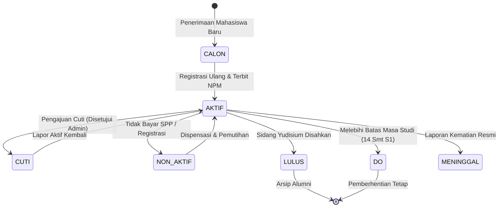

# 05 — Manajemen Civitas Akademika (Mahasiswa & Dosen)

> Modul pengelolaan profil identitas data pokok mahasiswa dan dosen, sistem penomoran induk resmi (NPM Generator 10 Digit & NIDN Validator), mutasi status akademik, serta integrasi akun autentikasi terpadu.

---

## 1. Tujuan & Ruang Lingkup Fitur

Civitas akademika adalah subjek utama seluruh proses tri dharma perguruan tinggi. Modul ini bertanggung jawab atas keakuratan data identitas personal, kepatuhan struktur penomoran induk sesuai regulasi nasional (PDDIKTI) dan institusi, serta manajemen transisi status keaktifan mahasiswa dan dosen.

### Ruang Lingkup Modul:
1. **Pangkalan Data Mahasiswa (`mahasiswa`)**:
   - Pola baku penomoran Nomor Pokok Mahasiswa (NPM) 10 digit angka (`^[0-9]{10}$`).
   - Mesin generator nomor urut NPM otomatis (*Auto-Sequence Generator*).
   - Registrasi mahasiswa baru tunggal maupun batch (impor CSV).
   - Mutasi status akademik (`AKTIF`, `CUTI`, `LULUS`, `DO`, `NON_AKTIF`, `MENINGGAL`).
2. **Pangkalan Data Dosen (`dosen`)**:
   - Nomor Induk Dosen Nasional (NIDN/NIDK) sebagai Primary Key unik numerik.
   - Pengelolaan gelar akademik, jabatan fungsional, dan program studi homebase.
   - Pemantauan Beban Kerja Dosen (BKD: batas ideal 12–16 SKS per semester).
3. **Penyediaan Akun Terpadu (Unified Onboarding)**:
   - Pembuatan record civitas sekaligus akun login Supabase Auth dan penugasan peran dalam satu transaksi atomik.

---

## 2. Desain Antarmuka Pengguna & Wireframe ASCII

### 2.1 Tampilan Penjelajah Data Mahasiswa (Desktop / Web ≥ 1024 px)
```
┌────────────────────────────────────────────────────────────────────────────────────────────────────────┐
│ 🎓 MANAJEMEN DATA MAHASISWA                           [⬇ Impor CSV]  [⬇ Ekspor Excel]  [+ Mahasiswa]  │
├────────────────────────────────────────────────────────────────────────────────────────────────────────┤
│ 🔍 [Cari NPM / Nama Mahasiswa...] │ Angkatan: [2026 ▼] │ Prodi: [Teknik Informatika ▼] │ Status: [Semua]│
├──────┬────────────┬────────────────────────┬─────────┬──────────┬────────┬───────┬─────────┬───────────┤
│ NO   │ NPM        │ NAMA LENGKAP           │ PRODI   │ ANGKATAN │ SKS    │ IPK   │ STATUS  │ AKSI      │
├──────┼────────────┼────────────────────────┼─────────┼──────────┼────────┼───────┼─────────┼───────────┤
│ 01   │ 2610010001 │ Aditya Pratama         │ S1 TI   │ 2026     │ 20 SKS │ 3.85  │ ● AKTIF │ [Detail 👁]│
│ 02   │ 2610010002 │ Amanda Putri Lestari   │ S1 TI   │ 2026     │ 20 SKS │ 3.70  │ ● AKTIF │ [Detail 👁]│
│ 03   │ 2510010045 │ Bagas Wicaksono        │ S1 TI   │ 2025     │ 42 SKS │ 2.45  │ 🟡 CUTI │ [Detail 👁]│
│ 04   │ 2310010012 │ Dimas Surya Nugraha    │ S1 TI   │ 2023     │ 88 SKS │ 1.95  │ 🔴 SP-2 │ [Detail 👁]│
│ 05   │ 2210010088 │ Fajar Kurniawan        │ S1 TI   │ 2022     │ 144 SKS│ 3.92  │ 🟢 LULUS│ [Detail 👁]│
├──────┴────────────┴────────────────────────┴─────────┴──────────┴────────┴───────┴─────────┴───────────┤
│ Total Mahasiswa Terpilih: 1.420 Mahasiswa  (Aktif: 1.350 | Cuti: 42 | Lulus: 25 | DO: 3)               │
└────────────────────────────────────────────────────────────────────────────────────────────────────────┘
```

### 2.2 Wireframe Modal Registrasi Mahasiswa Baru & Generator NPM
```
┌────────────────────────────────────────────────────────────────┐
│ ➕ FORMULIR REGISTRASI MAHASISWA BARU                  [ X ]   │
├────────────────────────────────────────────────────────────────┤
│ 1. DATA AKADEMIK PENERIMAAN                                    │
│    Program Studi *     : [ S1 Teknik Informatika (Kode: 10) ▼ ]│
│    Tahun Angkatan *    : [ 2026                             ▼ ]│
│    Jalur Masuk         : [ Seleksi Mandiri Prestasi         ▼ ]│
│                                                                │
│ 2. NOMOR POKOK MAHASISWA (NPM 10 DIGIT)                        │
│    [ Angkatan: 26 ] [ Fak: 100 ] [ Prodi: 10 ] [ Urut: 0042 ]  │
│    NPM Yang Dihasilkan : [ 2610010042                        ] │
│    [⟳ Regenerasi Nomor Urut]   (o) Gunakan Generator Otomatis  │
│                                                                │
│ 3. BIODATA PRIBADI                                             │
│    Nama Lengkap *      : [ Muhammad Rizky Ramadhan           ] │
│    NIK KTP (16 Digit) *: [ 3201234567890001                  ] │
│    Jenis Kelamin *     : (o) Laki-laki    ( ) Perempuan        │
│    Tanggal Lahir *     : [ 15 Mei 2008              ] [📅]     │
│    Email Institusi *   : [ rizky.2610010042@mhs.kampus.ac.id ] │
│    Nomor HP / WhatsApp : [ +62 813-9876-5432                 ] │
│                                                                │
│ 4. INTEGRASI AKUN LOGIN (SUPABASE AUTH)                        │
│    [X] Buat akun login secara otomatis                         │
│    Kata Sandi Awal     : (o) Default: NPM#TglLahir (2610010042#150508)
├────────────────────────────────────────────────────────────────┤
│ [ Batal ]                                [ Daftarkan Mahasiswa]│
└────────────────────────────────────────────────────────────────┘
```

---

## 3. Rincian Fitur & Aturan Bisnis

### 3.1 Struktur Format NPM Baku (10 Digit Angka)
Sesuai constraint regex pada skema basis data (`CHECK (npm ~ '^[0-9]{10}$')`), setiap NPM mahasiswa disusun dengan formula deterministik:
$$\text{NPM} = \underbrace{\text{AA}}_{2\text{ digit}} + \underbrace{\text{FFF}}_{3\text{ digit}} + \underbrace{\text{PP}}_{2\text{ digit}} + \underbrace{\text{UUU}}_{3\text{ digit}}$$

| Segmen | Panjang | Deskripsi | Contoh |
| :--- | :---: | :--- | :--- |
| **AA** | 2 Digit | Dua digit terakhir tahun masuk / angkatan mahasiswa. | `26` (Angkatan 2026) |
| **FFF** | 3 Digit | Kode unik fakultas penyelenggara prodi. | `100` (Fakultas Teknologi Informasi) |
| **PP** | 2 Digit | Kode unik program studi (`program_studi.kode`). | `10` (Teknik Informatika) |
| **UUU** | 3 Digit | Nomor urut pendaftaran mahasiswa dalam prodi & angkatan tersebut. | `001` s.d. `999` |

**Contoh NPM Lengkap**: `2610010001` atau `2610010042`.

### 3.2 Mesin Generator Nomor Urut NPM (Sequence Generator)
- Sistem mencari nomor urut terbesar (`MAX(SUBSTRING(npm, 8, 3)::INTEGER)`) untuk kombinasi prefix 7 digit (`AA + FFF + PP`) yang sama.
- Nomor urut berikutnya diisi dengan `MAX + 1` dipad dengan angka nol di depan (`LPAD(..., 3, '0')`).
- Menangani konkurensi pendaftaran serentak dengan menggunakan PostgreSQL Advisory Lock atau isolasi transaksi tingkat database untuk mencegah nomor urut duplikat.

### 3.3 State Machine Mutasi Status Mahasiswa


- **Dampak Status Akademik**:
  - `AKTIF`: Memiliki hak penuh mengisi KRS, presensi kelas, dan mendapatkan transkrip.
  - `CUTI`: Dikecualikan dari tagihan SPP penuh, masa studi tidak dihitung, portal KRS terkunci sementara.
  - `NON_AKTIF`: Terblokir dari seluruh kegiatan perkuliahan, masa studi tetap dihitung berjalan.
  - `LULUS`: Status akun terkunci dalam mode baca (*read-only*), peran beralih ke portal alumni.
  - `DO`: Akun login dinonaktifkan permanen, diterbitkan Surat Keputusan Pemberhentian Studi.

### 3.4 Data Dosen & Batasan Beban Kerja Dosen (BKD)
- **Atribut NIDN**: Primary Key unik dengan validasi numerik `CHECK (nidn ~ '^[0-9]+$')`.
- **Gelar Akademik**: Pemisahan penyimpanan gelar depan (misal: "Prof. Dr.") dan gelar belakang (misal: "S.T., M.Kom., Ph.D.") untuk standarisasi pencetakan ijazah.
- **Monitoring Batas Beban Mengajar (BKD Check)**:
  - Regulasi Kementerian mensyaratkan beban mengajar dosen berada di antara **12 s.d. 16 SKS** per semester.
  - Sistem memberikan peringatan visual (*warning alert*) apabila seorang dosen dialokasikan < 12 SKS (kurang beban) atau > 16 SKS (kelebihan beban mengajar) pada periode aktif berjalan.

---

## 4. Logika Bisnis & Algoritma Penunjang

### 4.1 Algoritma Generator NPM Otomatis (Dart)
```dart
class NpmGenerator {
  static String generateNpm({
    required int year,             // contoh: 2026
    required String facultyCode,   // contoh: "100" (3 digit)
    required String prodiCode,     // contoh: "10"  (2 digit)
    required int nextSequence,     // contoh: 42
  }) {
    final yearSuffix = (year % 100).toString().padLeft(2, '0');
    final faculty = facultyCode.padLeft(3, '0');
    final prodi = prodiCode.padLeft(2, '0');
    final seq = nextSequence.toString().padLeft(3, '0');
    
    final npm = '$yearSuffix$faculty$prodi$seq';
    assert(RegExp(r'^[0-9]{10}$').hasMatch(npm), 'NPM harus tepat 10 digit angka!');
    return npm;
  }
}
```

### 4.2 Prosedur Terpadu Pendaftaran Mahasiswa Baru
```sql
CREATE OR REPLACE FUNCTION public.fn_register_student_atomic(
    p_year INTEGER,
    p_faculty_code VARCHAR(3),
    p_prodi_id UUID,
    p_prodi_code VARCHAR(2),
    p_nama_lengkap VARCHAR(150),
    p_jenis_kelamin VARCHAR(1),
    p_tanggal_lahir DATE,
    p_email VARCHAR(150),
    p_telepon VARCHAR(30),
    p_actor_id UUID
)
RETURNS JSONB
LANGUAGE plpgsql
SECURITY DEFINER
AS $$
DECLARE
    v_year_prefix VARCHAR(2);
    v_prefix VARCHAR(7);
    v_next_seq INTEGER;
    v_npm VARCHAR(10);
    v_user_id UUID;
    v_role_id UUID;
BEGIN
    -- 1. Hitung Prefix 7 digit: AA + FFF + PP
    v_year_prefix := LPAD((p_year % 100)::TEXT, 2, '0');
    v_prefix := v_year_prefix || LPAD(p_faculty_code, 3, '0') || LPAD(p_prodi_code, 2, '0');

    -- 2. Ambil Nomor Urut Terakhir dengan Kunci Baris untuk Mencegah Race Condition
    SELECT COALESCE(MAX(SUBSTRING(npm, 8, 3)::INTEGER), 0) + 1
    INTO v_next_seq
    FROM public.mahasiswa
    WHERE npm LIKE (v_prefix || '%');

    IF v_next_seq > 999 THEN
        RAISE EXCEPTION 'Kapasitas kuota nomor urut mahasiswa prodi telah penuh (maks 999 mhs/angkatan).';
    END IF;

    -- 3. Susun NPM 10 Digit
    v_npm := v_prefix || LPAD(v_next_seq::TEXT, 3, '0');

    -- 4. Buat Akun pada public.user
    v_user_id := gen_random_uuid();
    INSERT INTO public."user" (id, email, nama_lengkap, telepon, aktif)
    VALUES (v_user_id, LOWER(p_email), p_nama_lengkap, p_telepon, true);

    -- 5. Beri Peran MAHASISWA
    SELECT id INTO v_role_id FROM public.role WHERE nama = 'MAHASISWA';
    IF v_role_id IS NOT NULL THEN
        INSERT INTO public.user_role (id_user, id_role) VALUES (v_user_id, v_role_id);
    END IF;

    -- 6. Injeksi Profil Mahasiswa
    INSERT INTO public.mahasiswa (
        npm, id_user, id_program_studi, nama_lengkap, tahun_masuk, jenis_kelamin, tanggal_lahir, status
    ) VALUES (
        v_npm, v_user_id, p_prodi_id, p_nama_lengkap, p_year, p_jenis_kelamin, p_tanggal_lahir, 'AKTIF'
    );

    -- 7. Catat Audit Log
    INSERT INTO public.log_aktivitas (id_user, aksi, entitas, id_entitas, metadata)
    VALUES (
        p_actor_id,
        'ADMIN_REGISTRASI_MAHASISWA',
        'mahasiswa',
        v_user_id,
        jsonb_build_object('npm', v_npm, 'nama', p_nama_lengkap, 'prodi_id', p_prodi_id)
    );

    RETURN jsonb_build_object('npm', v_npm, 'user_id', v_user_id);
END;
$$;
```

---

## 5. Skema Data & Kueri Database Terkait

### 5.1 Skema Tabel `public.mahasiswa` dan `public.dosen`
```sql
-- 1. Tabel Profil Mahasiswa
CREATE TABLE IF NOT EXISTS public.mahasiswa (
    npm VARCHAR(10) PRIMARY KEY,
    id_user UUID NOT NULL REFERENCES public."user"(id) ON DELETE RESTRICT,
    id_program_studi UUID NOT NULL REFERENCES public.program_studi(id) ON DELETE RESTRICT,
    nama_lengkap VARCHAR(150) NOT NULL,
    tahun_masuk INTEGER NOT NULL CHECK (tahun_masuk >= 2000 AND tahun_masuk <= 2100),
    jenis_kelamin VARCHAR(1) NOT NULL CHECK (jenis_kelamin IN ('L', 'P')),
    tanggal_lahir DATE NOT NULL,
    status VARCHAR(20) NOT NULL DEFAULT 'AKTIF' 
        CHECK (status IN ('AKTIF', 'CUTI', 'LULUS', 'DO', 'NON_AKTIF', 'MENINGGAL')),
    id_dosen_wali VARCHAR(20) REFERENCES public.dosen(nidn) ON DELETE SET NULL,
    dibuat_pada TIMESTAMP WITH TIME ZONE DEFAULT NOW(),
    diperbarui_pada TIMESTAMP WITH TIME ZONE DEFAULT NOW(),
    CONSTRAINT ck_npm_format CHECK (npm ~ '^[0-9]{10}$')
);

-- 2. Tabel Profil Dosen
CREATE TABLE IF NOT EXISTS public.dosen (
    nidn VARCHAR(20) PRIMARY KEY,
    id_user UUID NOT NULL REFERENCES public."user"(id) ON DELETE RESTRICT,
    id_program_studi UUID NOT NULL REFERENCES public.program_studi(id) ON DELETE RESTRICT,
    nama_lengkap VARCHAR(150) NOT NULL,
    gelar_depan VARCHAR(50),
    gelar_belakang VARCHAR(50),
    jenis_kelamin VARCHAR(1) NOT NULL CHECK (jenis_kelamin IN ('L', 'P')),
    tanggal_lahir DATE NOT NULL,
    status VARCHAR(20) NOT NULL DEFAULT 'AKTIF' CHECK (status IN ('AKTIF', 'TIDAK_AKTIF', 'TUGAS_BELAJAR')),
    jabatan_fungsional VARCHAR(50) DEFAULT 'TENAGA_PENGAJAR',
    dibuat_pada TIMESTAMP WITH TIME ZONE DEFAULT NOW(),
    diperbarui_pada TIMESTAMP WITH TIME ZONE DEFAULT NOW(),
    CONSTRAINT ck_nidn_format CHECK (nidn ~ '^[0-9]+$')
);

-- Indeks Pencarian Efisien
CREATE INDEX IF NOT EXISTS idx_mahasiswa_prodi_angkatan ON public.mahasiswa(id_program_studi, tahun_masuk);
CREATE INDEX IF NOT EXISTS idx_mahasiswa_status ON public.mahasiswa(status);
CREATE INDEX IF NOT EXISTS idx_dosen_prodi ON public.dosen(id_program_studi);
```

---

## 6. Struktur Log Aktivitas & Payload Metadata JSON

```json
{
  "event_timestamp": "2026-09-28T11:30:00+08:00",
  "actor_id": "c1f8a840-7e32-4759-9943-8f0a0d4c9801",
  "actor_name": "Administrator Pusat",
  "aksi": "ADMIN_MUTASI_STATUS_MAHASISWA",
  "entitas": "mahasiswa",
  "id_entitas": "2610010042",
  "metadata": {
    "npm": "2610010042",
    "nama_lengkap": "Muhammad Rizky Ramadhan",
    "previous_status": "AKTIF",
    "new_status": "CUTI",
    "sk_cuti_number": "SK-CUTI/FTI/2026/042",
    "alasan": "Alasan kesehatan / pemulihan pasca operasi",
    "periode_cuti": "Ganjil 2026/2027"
  }
}
```

---

## 7. Penanganan Kasus Khusus (Edge Cases) & Validasi Sistem

| Kasus Khusus / Skenario Ekstrem | Risiko Masalah | Solusi Penanganan Sistem |
| :--- | :--- | :--- |
| **Race condition saat 100 mhs diimpor serentak** | Potensi duplikasi nomor urut NPM. | Generator menggunakan Stored Procedure dengan level isolasi terkunci atau nomor urut terurut deterministik dalam single batch insert. |
| **Perubahan Nama/Gelar Dosen** | Histori nilai lama tidak sinkron dengan ijazah baru. | Nama dosen di transkrip akademik lama mengacu pada relasi NIDN, sedangkan nama display selalu membaca gelar mutakhir dari tabel `dosen`. |
| **Mahasiswa Cuti mencoba login dan mengisi KRS** | Melanggar aturan status akademik non-aktif. | Portal KRS otomatis memvalidasi `mahasiswa.status == 'AKTIF'`. Jika berstatus `CUTI`, tombol aksi dikunci dengan pesan informatif. |
| **Dosen Wali cuti tugas belajar** | Mahasiswa bimbingannya tidak ada yang menyetujui KRS. | Modul 11 secara otomatis mengalihkan (re-plot) mahasiswa asuhan ke dosen wali pengganti. |
| **Mahasiswa DO / Drop Out** | Nilai dan histori mata kuliah ikut terhapus. | Larangan hard-delete; status diubah menjadi `DO` dan seluruh riwayat nilai dibekukan (*frozen*) untuk arsip akreditasi kampus. |
