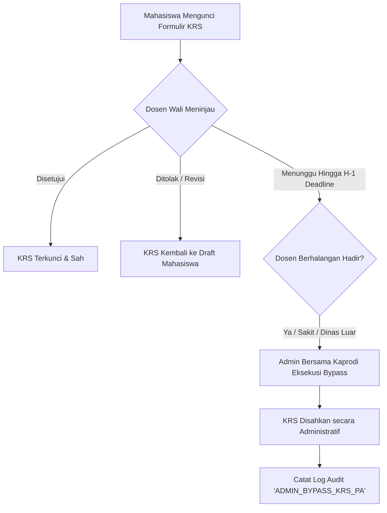

# 11 — Manajemen Dosen Wali & Bimbingan Akademik (Dosen PA)

> Modul pengelolaan penugasan Dosen Pembimbing Akademik (Dosen Wali), algoritma alokasi bimbingan merata (*Round-Robin Batch Allocation*), monitoring progres persetujuan KRS, otorisasi *Bypass Approval* darurat, serta sistem peringatan dini mahasiswa bimbingan (*Early Warning SP*).

---

## 1. Tujuan & Ruang Lingkup Fitur

Dosen Pembimbing Akademik (Dosen Wali / PA) bertindak sebagai pendamping studi mahasiswa dari semester awal hingga lulus. Modul ini menjamin pemerataan beban bimbingan dosen, memantau kelancaran verifikasi Kartu Rencana Studi (KRS), mencegah kebuntuan registrasi akibat dosen berhalangan hadir, serta menyediakan instrumen evaluasi kemajuan studi komprehensif.

### Ruang Lingkup Modul:
1. **Plotting & Alokasi Dosen Wali (`mahasiswa.id_dosen_wali`)**:
   - Penugasan mahasiswa baru secara batch menggunakan algoritma distribusi merata (*Round-Robin*).
   - Pengaturan kuota maksimal mahasiswa asuhan per dosen (standar ideal: 30–40 mahasiswa).
   - Mutasi dan re-alokasi massal ketika seorang dosen tugas belajar, cuti panjang, atau pensiun.
2. **Monitoring Approval KRS Mahasiswa Bimbingan**:
   - Pemantauan real-time status persetujuan KRS: *Belum Mengajukan*, *Pending Approval*, *Disetujui*, dan *Ditolak / Butuh Revisi*.
   - Fitur **Emergency Bypass Approval**: Hak administratif untuk mengesahkan KRS mahasiswa secara langsung apabila Dosen PA tidak dapat dihubungi hingga mendekati tenggat waktu (*deadline*).
3. **Sistem Peringatan Dini Mahasiswa Berisiko (At-Risk Early Warning)**:
   - Deteksi mahasiswa asuhan dengan IPS/IPK $< 2.00$ atau tren penurunan performa belajar.
   - Rekomendasi penerbitan Surat Peringatan Akademik (SP-1, SP-2, SP-3) dan penjadwalan konseling wajib.
4. **Buku Log Riwayat Bimbingan Akademik**:
   - Dokumentasi digital catatan konsultasi rencana studi, masalah adaptasi kampus, dan persetujuan topik riset skripsi.

---

## 2. Desain Antarmuka Pengguna & Wireframe ASCII

### 2.1 Tampilan Matriks Beban Dosen Wali (Desktop / Web ≥ 1024 px)
```
┌────────────────────────────────────────────────────────────────────────────────────────────────────────┐
│ 👨‍🏫 MANAJEMEN DOSEN WALI (PEMBIMBING AKADEMIK)                   [⚡ Alokasi Batch Mhs Baru] [⬇ Rekap]  │
├────────────────────────────────────────────────────────────────────────────────────────────────────────┤
│ Prodi: [ S1 Teknik Informatika ▼ ]   Periode: [ Ganjil 2025/2026 ● AKTIF ]   Total Mahasiswa: 1.420    │
│ Rasio Rata-rata Bimbingan: 1 Dosen : 32 Mahasiswa (Status: 🟢 Beban Merata & Seimbang)                │
├────────────────────────────────────────────────────────────────────────────────────────────────────────┤
│ 🔍 [Cari Dosen / NIDN...]              Filter Beban: [Semua ▼]              Urutkan: [Beban Terbanyak▼]│
├──────┬────────────┬────────────────────────┬──────────────┬──────────────┬──────────────┬──────────────┤
│ NO   │ NIDN       │ NAMA DOSEN WALI        │ JABATAN      │ TOTAL ASUHAN │ PROGRES KRS  │ STATUS AKSI  │
├──────┼────────────┼────────────────────────┼──────────────┼──────────────┼──────────────┼──────────────┤
│ 01   │ 0412088501 │ Dr. Aris Munandar      │ Lektor       │ 35 Mahasiswa │ 32/35 (91%)  │ [Kelola Mhs] │
│ 02   │ 0405027802 │ Hendra Wijaya, M.Eng.  │ Asisten Ahli │ 34 Mahasiswa │ 34/34 (100%) │ [Kelola Mhs] │
│ 03   │ 0419098901 │ Budi Santoso, M.T.     │ Lektor       │ 36 Mahasiswa │ 18/36 (50%)  │ [⚠️ REMINDER]│
│ 04   │ 0422119102 │ Dr. Siti Nurhaliza     │ Lektor       │ 35 Mahasiswa │ 35/35 (100%) │ [Kelola Mhs] │
│ 05   │ 0430128003 │ Prof. Dr. Ir. Suyanto  │ Guru Besar   │ 12 Mahasiswa │ 12/12 (100%) │ [Kelola Mhs] │
├──────┴────────────┴────────────────────────┴──────────────┴──────────────┴──────────────┴──────────────┤
│ ⚠️ Budi Santoso, M.T. memiliki 18 pengajuan KRS pending yang belum ditinjau mendekati deadline KRS!     │
└────────────────────────────────────────────────────────────────────────────────────────────────────────┘
```

### 2.2 Wireframe Modal Wizard Alokasi Merata Mahasiswa Baru (Round-Robin)
```
┌────────────────────────────────────────────────────────────────┐
│ 🎲 WIZARD ALOKASI OTOMATIS DOSEN WALI (BATCH ROUND-ROBIN)[ X ] │
├────────────────────────────────────────────────────────────────┤
│ Program Studi Target : [ S1 Teknik Informatika              ▼ ]│
│ Angkatan Mahasiswa   : [ 2026 (Mahasiswa Baru)              ▼ ]│
│ Mahasiswa Belum Punya PA: 120 Mahasiswa Baru                   │
├────────────────────────────────────────────────────────────────┤
│ PILIH DOSEN WALI TUJUAN (CENTANG MINIMAL 2 DOSEN):             │
│ [X] Dr. Aris Munandar       (Kuota Saat Ini: 0 Mhs Baru)       │
│ [X] Hendra Wijaya, M.Eng.   (Kuota Saat Ini: 0 Mhs Baru)       │
│ [X] Budi Santoso, M.T.      (Kuota Saat Ini: 0 Mhs Baru)       │
│ [X] Dr. Siti Nurhaliza      (Kuota Saat Ini: 0 Mhs Baru)       │
│                                                                │
│ SIMULASI DISTRIBUSI:                                           │
│ 120 Mahasiswa dibagi ke 4 Dosen -> Masing-masing: 30 Mahasiswa │
│ Metode Pembagian: (o) Alfabetis Nama  ( ) Nomor Urut NPM       │
├────────────────────────────────────────────────────────────────┤
│ [ Batalkan ]                             [ Jalankan Pembagian ]│
└────────────────────────────────────────────────────────────────┘
```

---

## 3. Rincian Fitur & Aturan Bisnis

### 3.1 Algoritma Distribusi Merata (*Round-Robin Allocation*)
Saat penerimaan mahasiswa baru, puluhan hingga ratusan mahasiswa wajib dibagi secara proporsional ke dosen-dosen yang aktif:
1. Sistem mengambil daftar mahasiswa yang belum memiliki Dosen Wali (`id_dosen_wali IS NULL`) untuk angkatan dan prodi terpilih, diurutkan berdasarkan NPM.
2. Sistem mengambil daftar Dosen terpilih beserta kapasitas sisa kuota masing-masing.
3. Mahasiswa dipetakan satu per satu secara bergiliran (*round-robin*) ke dosen $1, 2, \dots, k, 1, 2, \dots$ sampai seluruh mahasiswa teralokasikan.
4. Seluruh pemetaan disimpan dalam satu transaksi atomik.

### 3.2 Alur Persetujuan KRS & Emergency Bypass


- **Syarat Sah Eksekusi Bypass oleh Admin**:
  1. Batas waktu portal KRS tersisa $\le 24$ jam.
  2. Dosen Wali telah dikirimi minimal 2 kali reminder sistem tanpa respons.
  3. Mahasiswa tidak melanggar ketentuan beban SKS dan tidak bentrok jadwal.
  4. Disertai catatan administratif resmi (misal: *"Bypass darurat atas izin Kaprodi karena Dosen PA sakit rawat inap"*).

### 3.3 Sistem Peringatan Dini Akademik (Early Warning & Surat Peringatan)
Sistem secara otomatis mengelompokkan mahasiswa bimbingan berdasarkan tingkat risiko:
- **Peringatan 1 (SP-1 / Kuning)**: Mahasiswa dengan IPS semester berjalan $< 2.00$ untuk pertama kali.
- **Peringatan 2 (SP-2 / Oranye)**: Mahasiswa dengan IPS berturut-turut $< 2.00$ selama dua semester, atau mahasiswa semester 6 dengan total SKS $< 80$ SKS.
- **Peringatan 3 (SP-3 / Merah / Terancam DO)**: Mahasiswa semester 12 yang belum menyelesaikan seminar proposal tugas akhir (batas maksimal masa studi S1 adalah 14 semester).
- Notifikasi otomatis dikirimkan ke dashboard Dosen Wali dan orang tua/wali mahasiswa.

---

## 4. Logika Bisnis & Algoritma Penunjang

### 4.1 Algoritma Pembagian Mahasiswa Asuhan Round-Robin (Dart)
```dart
class AcademicAdvisorDistributor {
  static Map<String, List<String>> distribute({
    required List<String> studentNpms,
    required List<String> lecturerNidns,
  }) {
    assert(lecturerNidns.isNotEmpty, 'Daftar dosen tidak boleh kosong!');
    final distribution = <String, List<String>>{};
    for (final nidn in lecturerNidns) {
      distribution[nidn] = [];
    }

    for (int i = 0; i < studentNpms.length; i++) {
      final targetNidn = lecturerNidns[i % lecturerNidns.length];
      distribution[targetNidn]!.add(studentNpms[i]);
    }

    return distribution;
  }
}
```

### 4.2 Prosedur Eksekusi Bypass Persetujuan KRS oleh Admin
```sql
CREATE OR REPLACE FUNCTION public.fn_admin_emergency_bypass_krs(
    p_student_npm VARCHAR(10),
    p_alasan TEXT,
    p_actor_id UUID
)
RETURNS VOID
LANGUAGE plpgsql
SECURITY DEFINER
AS $$
DECLARE
    v_advisor_nidn VARCHAR(20);
    v_student_name TEXT;
BEGIN
    -- Validasi wewenang Admin
    IF NOT EXISTS (
        SELECT 1 FROM public.user_role ur
        JOIN public.role r ON ur.id_role = r.id
        WHERE ur.id_user = p_actor_id AND r.nama = 'ADMIN'
    ) THEN
        RAISE EXCEPTION 'Akses Ditolak: Hanya Administrator yang berwenang mengeksekusi Bypass Approval KRS.';
    END IF;

    -- Ambil data Dosen Wali & Mahasiswa
    SELECT id_dosen_wali, nama_lengkap INTO v_advisor_nidn, v_student_name
    FROM public.mahasiswa
    WHERE npm = p_student_npm;

    -- Update seluruh KRS aktif mahasiswa menjadi disetujui
    UPDATE public.krs
    SET disetujui_oleh_pa = true,
        status = 'AKTIF',
        catatan_pa = 'Disetujui melalui Otorisasi Darurat Administrator (Bypass): ' || p_alasan,
        diperbarui_pada = NOW()
    WHERE id_mahasiswa = p_student_npm;

    -- Catat kejadian pada log aktivitas
    INSERT INTO public.log_aktivitas (id_user, aksi, entitas, id_entitas, metadata)
    VALUES (
        p_actor_id,
        'ADMIN_BYPASS_APPROVAL_KRS',
        'krs',
        p_student_npm,
        jsonb_build_object(
            'npm', p_student_npm,
            'student_name', v_student_name,
            'original_advisor_nidn', v_advisor_nidn,
            'alasan', p_alasan,
            'bypassed_at', NOW()
        )
    );
END;
$$;
```

---

## 5. Skema Data & Kueri Database Terkait

### 5.1 Skema Tabel Bimbingan & Catatan Konsultasi
```sql
-- Tabel Catatan Konsultasi Bimbingan Dosen Wali
CREATE TABLE IF NOT EXISTS public.bimbingan_akademik (
    id UUID PRIMARY KEY DEFAULT gen_random_uuid(),
    id_mahasiswa VARCHAR(10) NOT NULL REFERENCES public.mahasiswa(npm) ON DELETE CASCADE,
    id_dosen VARCHAR(20) NOT NULL REFERENCES public.dosen(nidn) ON DELETE RESTRICT,
    id_periode_akademik UUID NOT NULL REFERENCES public.periode_akademik(id) ON DELETE RESTRICT,
    tanggal_konsultasi DATE NOT NULL DEFAULT CURRENT_DATE,
    topik_bimbingan VARCHAR(150) NOT NULL, -- Contoh: "Konsultasi KRS Semester 5", "Evaluasi Penurunan IPK"
    catatan_dosen TEXT NOT NULL,
    solusi_rekomendasi TEXT,
    status_verifikasi_krs BOOLEAN DEFAULT false,
    dibuat_pada TIMESTAMP WITH TIME ZONE DEFAULT NOW()
);

CREATE INDEX IF NOT EXISTS idx_bimbingan_mhs ON public.bimbingan_akademik(id_mahasiswa);
CREATE INDEX IF NOT EXISTS idx_bimbingan_dosen ON public.bimbingan_akademik(id_dosen);
```

### 5.2 Database View: Rekapitulasi Beban Bimbingan per Dosen
```sql
CREATE OR REPLACE VIEW public.v_rekap_beban_dosen_wali AS
SELECT 
    d.nidn,
    d.nama_lengkap,
    ps.nama AS nama_prodi,
    COUNT(m.npm) AS total_mahasiswa_bimbingan,
    COUNT(CASE WHEN m.status = 'AKTIF' THEN 1 END) AS total_mahasiswa_aktif,
    COUNT(CASE WHEN m.status = 'CUTI' THEN 1 END) AS total_mahasiswa_cuti,
    ROUND(AVG(COALESCE(sub.ipk, 0.00)), 2) AS rata_rata_ipk_asuhan
FROM public.dosen d
JOIN public.program_studi ps ON d.id_program_studi = ps.id
LEFT JOIN public.mahasiswa m ON d.nidn = m.id_dosen_wali
LEFT JOIN (
    -- Subquery rata-rata IPK mahasiswa
    SELECT id_mahasiswa, AVG(bobot_nilai) AS ipk 
    FROM public.nilai 
    WHERE sudah_final = true 
    GROUP BY id_mahasiswa
) sub ON m.npm = sub.id_mahasiswa
WHERE d.status = 'AKTIF'
GROUP BY d.nidn, d.nama_lengkap, ps.nama;
```

---

## 6. Struktur Log Aktivitas & Payload Metadata JSON

```json
{
  "event_timestamp": "2026-09-28T12:45:00+08:00",
  "actor_id": "c1f8a840-7e32-4759-9943-8f0a0d4c9801",
  "actor_name": "Administrator Pusat",
  "aksi": "ADMIN_BYPASS_APPROVAL_KRS",
  "entitas": "krs",
  "id_entitas": "2410010015",
  "metadata": {
    "npm": "2410010015",
    "student_name": "Reza Pratama",
    "original_advisor_nidn": "0419098901",
    "advisor_name": "Budi Santoso, M.T.",
    "alasan": "Dosen Wali tugas dinas luar kota tanpa sinyal internet menjelang penutupan KRS",
    "total_sks_approved": 22
  }
}
```

---

## 7. Penanganan Kasus Khusus (Edge Cases) & Validasi Sistem

| Skenario Kasus Khusus | Risiko Masalah | Solusi Penanganan Sistem |
| :--- | :--- | :--- |
| **Dosen Wali memasuki masa pensiun / mutasi instansi** | Puluhan mahasiswa asuhan kehilangan pembimbing akademik. | Fitur *Mass Transfer Advisor*: Admin memilih Dosen Lama dan mengalihkan seluruh relasi `mahasiswa.id_dosen_wali` ke Dosen Pengganti dalam 1 klik. |
| **Mahasiswa mengajukan bimbingan tapi tidak pernah hadir luring** | Persetujuan KRS terkatung-katung. | Sistem mendukung modul konsultasi digital (chat bimbingan & riwayat revisi KRS daring langsung di dalam aplikasi). |
| **Dosen menolak KRS mahasiswa** | Mahasiswa kebingungan mata kuliah apa yang harus diperbaiki. | Form penolakan Dosen Wali wajib menyertakan field `catatan_revisi` yang langsung muncul di banner dashboard mahasiswa. |
| **Ketimpangan beban bimbingan antar dosen** | Dosen senior memiliki 100 asuhan, sedangkan dosen junior hanya 5. | Sistem menampilkan peringatan merah jika alokasi asuhan seorang dosen melampaui batas toleransi institusi (> 45 mahasiswa). |
